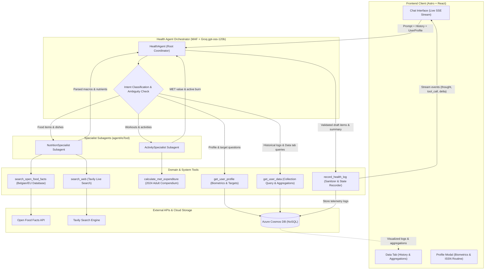

# agentic health tracker

my published app is private, this is just the code if you want to use it for yourself but you will need to set it up for yourself. using this will ultimately give you a **public static web app URL** that you can use across devices to let the agent track your health and fitness progress.

typical use is for saying what you ate or what activity you did and agent being able to log the correct values, with a nice dashboard to visualize your progress based on your profile and goals with scientifically backed math and stuff.

- **AI**: uses a MAF (Microsoft Agent Framework) agent with model from Groq API (openai/gpt-oss-120b), which has subagents and tools for delegating specific agentic tasks based on user request.
- **App**: deployed on SWA (static web app) with managed functions.
- **Data**: cosmosdb for nosql for persistent data storage and optimized retrievals.
- **Web search**: uses tavily api for web search to get relevant information online.
- **Food data**: uses open food facts api for food nutrition data.
- **Github**: repo for the code, used automated ci/cd for deployment for swa and functions.

> [!TIP]
> deploying, running and using this app is completely free through azure (if using cosmosdb free tier)

## preview

### chat


### data


## quickstart

1. clone the repo

```pwsh
git clone "https://github.com/aryxenv/agentic-health-tracker.git"
```

2. delete the `.git` folder from the cloned repo, and delete the `.github` folder since SWA automatically makes it for you.

```pwsh
cd agentic-health-tracker
rm -rf .git
```

3. create repo on github called `agentic-health-tracker` and push the code to it

4. create a new repo on your github account and push the code to it

```pwsh
git init
git add .
git commit -m "initial commit"
git remote add origin "<your-github-repo-url>"
git push -u origin main
```

5. llm provider: get an api key from [Groq API](https://groqapi.com/) and copy it somewhere safe. u will need it later

6. web search: get an api key from [Tavily](https://tavily.com/) and copy it somewhere safe. u will need it later

7. create a file called `local.settings.json` in the `api` folder with the following content (fill in the groq and tavily key here, leave the rest as-is):

```json
{
  "IsEncrypted": false,
  "Values": {
    "AzureWebJobsStorage": "UseDevelopmentStorage=false",
    "FUNCTIONS_WORKER_RUNTIME": "node",
    "GROQ_API_KEY": "<YOUR_GROQ_API_KEY>",
    "TAVILY_API_KEY": "<YOUR_TAVILY_API_KEY>",
    "COSMOS_ENDPOINT": "<>YOUR_COSMOS_ENDPOINT>",
    "COSMOS_KEY": "<YOUR_COSMOS_KEY>",
    "COSMOS_DATABASE_ID": "<YOUR_COSMOS_DATABASE_ID>",
    "COSMOS_CONTAINER_ID": "<YOUR_COSMOS_CONTAINER_ID>"
  },
  "Host": {
    "CORS": "*"
  }
}
```

8.  on azure, create a resource group called `agentic-health-tracker`

9.  open the folder with an agent of your choice and give it this prompt to set up cosmosdb, you can let this run in the background while you move onto the next step

> [!IMPORTANT]
> you must be logged in with Azure CLI for this to work through the agent, and it's recommended to set an allow-all permission so the agent can use terminal commands without continuous approval.

```md
Set up Azure Cosmos DB for NoSQL for this project using my active Azure CLI login:

1. **Provision Cloud Resources:**
   - Resource Group: `agentic-health-tracker` (create in a preferred region like `west-europe` if it doesn't exist).
   - Cosmos DB Account: Generate a globally unique name (e.g., `cdb-healthtracker-<randomSuffix>`). Use `--kind GlobalDocumentDB`, `--default-consistency-level Session`, and enable free tier if eligible (`--enable-free-tier true`). if not eligible for free tier, flag this for the user in the end.
   - Database: Create an SQL database named `health-tracker-db`.
   - Container: Create an SQL container named `health_tracker` with partition key `/userId` and dedicated throughput of `400` RU/s.

2. **Retrieve Credentials:**
   - Fetch the account endpoint (`https://<account-name>.documents.azure.com:443/`) and the primary master key via `az cosmosdb keys list`.

3. **Update Cloned Codebase:**
   - In `api/src/services/cosmosService.ts`, update the default fallback values (`DEFAULT_DATABASE_ID`, `DEFAULT_CONTAINER_ID`, and default endpoint URL) to match the new account and database names.
   - In `api/local.settings.json`, populate:
     - `COSMOS_ENDPOINT`
     - `COSMOS_KEY`
     - `COSMOS_DATABASE_ID`
     - `COSMOS_CONTAINER_ID`
```

10. create a new static web app on azure portal, and link it to your github repo. make sure to select the correct branch (`main`) and folder for the build. check the configs below


11. review and create the swa resource and wait for like 5 mins till it's ready. you will get a public url for your swa which is basically your app url.

12. before you access your app url, you need to set some environment variables on the swa resource. go to your swa resource, then under settings go to environment variables, and add the following variables with the values (check `api/local.settings.json` for the values you need to set):

| Name                | Value                      |
| ------------------- | -------------------------- |
| GROQ_API_KEY        | <YOUR_GROQ_API_KEY>        |
| TAVILY_API_KEY      | <YOUR_TAVILY_API_KEY>      |
| COSMOS_ENDPOINT     | <YOUR_COSMOS_ENDPOINT>     |
| COSMOS_KEY          | <YOUR_COSMOS_KEY>          |
| COSMOS_DATABASE_ID  | <YOUR_COSMOS_DATABASE_ID>  |
| COSMOS_CONTAINER_ID | <YOUR_COSMOS_CONTAINER_ID> |

13. that's it, you should now be able to go on the swa public url and use the app.

## bonus

if you want to turn this into an app on your phone, you can (if you have chrome on your phone)

1. open the url in chrome on your phone

2. click on the 3 dots on the top right corner, and select "Install and create shortcut", and select the option "Install"


3. now you can access the app from your home screen like a normal app, and it will open in full screen without the browser stuff.

## details

### how the agent works

#### high-level architecture



#### system prompt distillation

The agent's decision-making and tool orchestration are governed by six core protocols:

1. **Nutritional Fact Grounding**:
   - Packaged grocery products (especially Belgian and European supermarket brands like Melkunie, Albert Heijn, Delhaize, Colruyt) are queried against `search_open_food_facts`.
   - Restaurant dishes, cooked meals, recipes, or unlisted foods fall back to live internet retrieval via `search_web` (Tavily).
   - All 7 core nutrients are calculated and scaled to portion: calories, protein (g), carbs (g), fat (g), fiber (g), sugar (g), and sodium (mg).

2. **Biomechanical Energy Expenditure**:
   - Exercises apply the **2024 Adult Compendium of Physical Activities** MET formulas using user body weight:
     - $\text{Total Burn} = \text{MET} \times \text{weight (kg)} \times \frac{\text{duration (min)}}{60}$
     - $\text{Net Active Burn} = (\text{MET} - 1) \times \text{weight (kg)} \times \frac{\text{duration (min)}}{60}$ (resting metabolic rate is excluded to prevent double-counting against BMR).

3. **Ambiguity & Context-Aware Estimation Protocol**:
   - **Ambiguity Detection**: If an entry lacks necessary portion sizes or durations, the agent prompts for clarification and offers an `"estimate"` alternative.
   - **Context-Aware Scaling**: When the user requests an estimate, the agent **never defaults blindly to static generic portions**. It actively scans for descriptive context clues (*size adjectives like "big bowl" or "small slice"*, *packaging fractions like "half the bottle"*, or *modifiers like "shared with a friend"*) to scale the estimate logically and explains the reasoning transparently.

4. **Multi-Turn Context Reconciler**:
   - Maintains memory across conversation turns. If the user modifies, corrects, or appends items (*"actually make that 3 eggs"*, *"change to 45 mins"*), the agent regenerates the full, updated set of draft entries rather than appending duplicates.

5. **Profile & Historical Collection Retrieval**:
   - `get_user_profile`: Returns calibrated biometrics (weight, height, age, sex, goal) and derived targets (BMR, TDEE, ISSN protein multiplier: 1.3g to 2.2g/kg based on training routine, fat, carbs, fiber, sugar, sodium).
   - `get_user_data`: Provides filtered access to the user's logged telemetry (by `time_filter`, `type`, `meal_type`, or `search_query`) and computes net calories and macro sums directly mirroring the Data tab.
   - For pure retrieval questions, the agent sets `draft_entries: []` so no phantom items are logged.

6. **Execution Sequence**:
   - Consults subagents/tools to calculate figures $\rightarrow$ invokes `record_health_log` with draft entries and reply $\rightarrow$ streams a concise, encouraging scientific summary to the user.

---

#### common covered use cases

##### 1. logging food intake (european grocery & meal lookup)
- **User input**: *"I drank 250ml Melkunie strawberry protein drink and ate 1 banana"*
- **How the system handles it**:
  1. `HealthAgent` deconstructs the request and consults `NutritionSpecialist`.
  2. `NutritionSpecialist` calls `search_open_food_facts("Melkunie strawberry protein drink")` to fetch the exact manufacturer nutrition facts per 100ml from the Belgian/EU database and scales it to 250ml.
  3. Looks up banana nutrition facts and sums the combined intake.
  4. Calls `record_health_log` with `needs_clarification: false` and the calculated draft entries.
  5. The UI displays interactive draft cards for immediate user confirmation or adjustment.

##### 2. ambiguous portion with context-aware "estimate"
- **User input**:
  - *Turn 1*: *"I had a big bowl of oatmeal for breakfast"*
  - *Agent*: *"How much oatmeal did you have? If you're not sure, reply with 'estimate' and I'll make a reasonable assumption based on your description."*
  - *Turn 2*: *"estimate"*
- **How the system handles it**:
  1. Turn 1 detects missing grams/volume $\rightarrow$ sets `needs_clarification: true` with an interactive clarification prompt.
  2. On Turn 2, the agent resolves the estimate. Rather than using a generic standard 40g dry serving, it extracts the context clue *"big bowl"*.
  3. Scales the portion up logically ($\sim 1.5\times$ to 60g dry oats, $\sim 225\text{ kcal}$).
  4. Transparently explains the deduction: *"Based on your description of a 'big bowl', I estimated ~60g rolled oats..."*.
  5. Records the draft entries into the system.

##### 3. physical activity & biomechanical met expenditure
- **User input**: *"Went for a 45 min vigorous run"*
- **How the system handles it**:
  1. `HealthAgent` consults `ActivitySpecialist` with the user's profile weight (e.g. 75 kg).
  2. Subagent matches running to the **2024 Adult Compendium of Physical Activities** (base MET 9.8 with vigorous intensity multiplier $\rightarrow$ 12.3 MET).
  3. Calls `calculate_met_expenditure` for 45 minutes:
     - Total Burn: $12.3 \times 75\text{ kg} \times 0.75\text{ hr} = 692\text{ kcal}$.
     - Net Active Burn: $(12.3 - 1) \times 75\text{ kg} \times 0.75\text{ hr} = 636\text{ kcal}$.
  4. Sets food macros to 0, modality to `cardio`, and intensity to `vigorous`.
  5. Calls `record_health_log` to present the workout draft card.

##### 4. historical collection & daily budget retrieval
- **User input**: *"How much protein do I have left to hit my goal today?"*
- **How the system handles it**:
  1. `HealthAgent` identifies an informational query about daily targets and historical collection data.
  2. Calls `get_user_profile()` to fetch the user's calibrated daily protein target (e.g. 135g for a 75kg user on a Strength routine).
  3. Calls `get_user_data(time_filter: "today")` to fetch today's logged food entries and calculate total protein consumed so far (e.g. 50g).
  4. Computes the remaining delta: $135\text{g} - 50\text{g} = 85\text{g}$ remaining.
  5. Calls `record_health_log` with `draft_entries: []` and `needs_clarification: false` (avoiding logging phantom items).
  6. Streams a helpful response showing consumed vs target protein with personalized recommendations.
