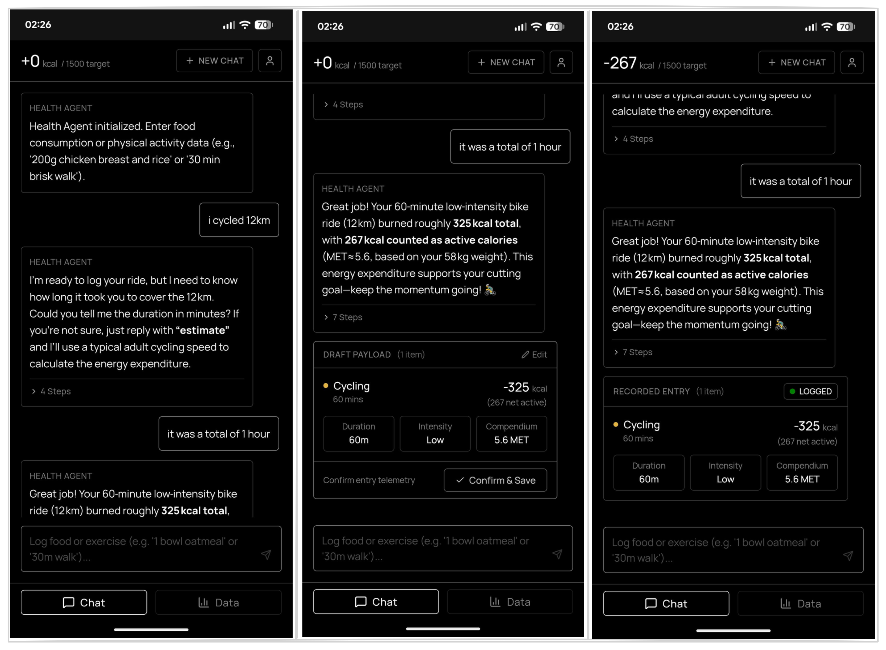
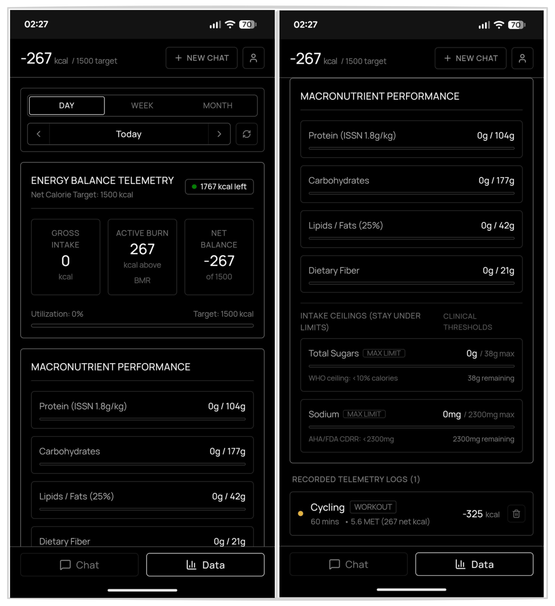
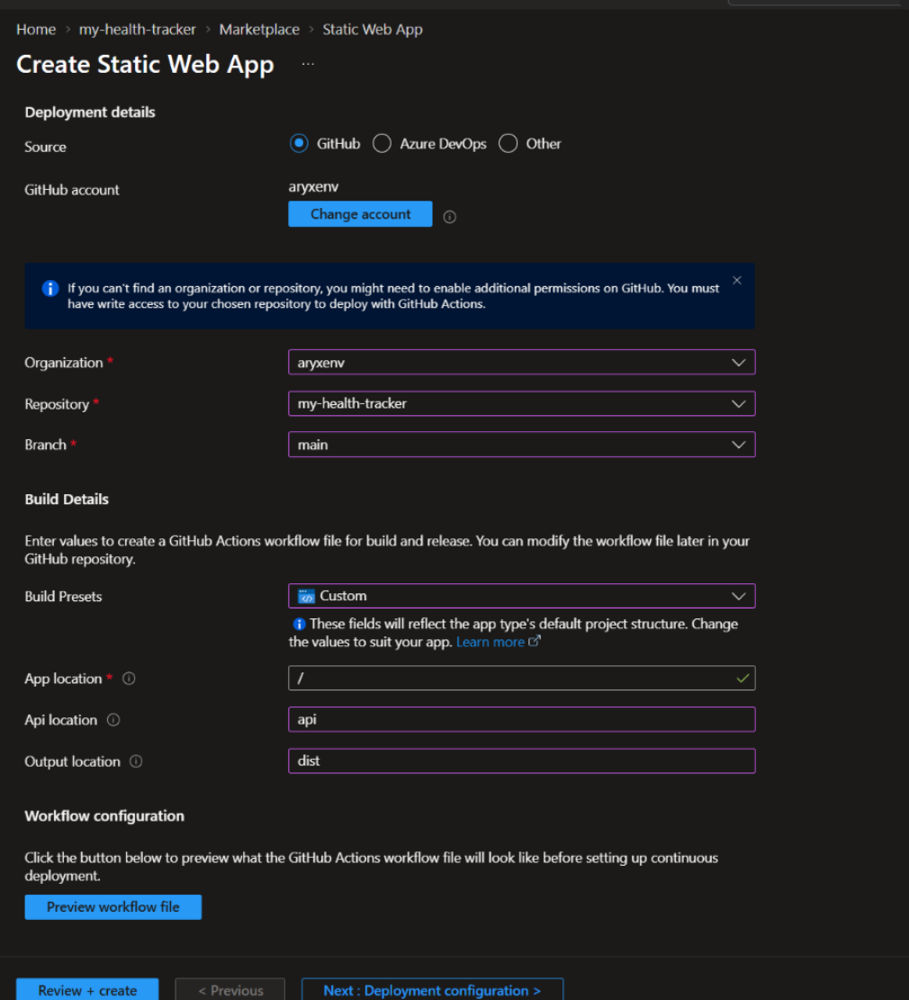
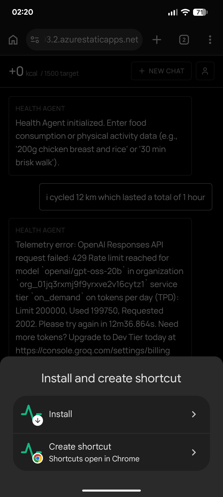

# agentic health tracker

my published app is private, this is just the code if you want to use it for yourself but you will need to set it up for yourself. using this will ultimately give you a **public static web app URL** that you can use across devices to let the agent track your health and fitness progress.

typical use is for saying what you ate or what activity you did and agent being able to log the correct values, with a nice dashboard to visualize your progress based on your profile and goals with scientifically backed math and stuff.

- **AI**: uses a MAF (Microsoft Agent Framework) agent with model from Groq API (openai/gpt-oss-120b), which has subagents and tools for delegating specific agentic tasks based on user request.
- **App**: deployed on SWA (static web app) with managed functions.
- **Data**: cosmosdb for nosql for persistent data storage and optimized retrievals.
- **Web search**: uses tavily api for web search to get relevant information online.
- **Food data**: uses open food facts api for food nutrition data.
- **Github**: repo for the code, used automated ci/cd for deployment for swa and functions.

> [!TIP]
> deploying, running and using this app is completely free through azure (if using cosmosdb free tier)

## preview

### chat



### data



## quickstart

1. clone the repo

```pwsh
git clone "https://github.com/aryxenv/agentic-health-tracker.git"
```

2. delete the `.git` folder from the cloned repo, and delete the `.github` folder since SWA automatically makes it for you.

```pwsh
cd agentic-health-tracker
rm -rf .git
```

3. create repo on github called `agentic-health-tracker` and push the code to it

4. create a new repo on your github account and push the code to it

```pwsh
git init
git add .
git commit -m "initial commit"
git remote add origin "<your-github-repo-url>"
git push -u origin main
```

5. llm provider: get an api key from [Groq API](https://groqapi.com/) and copy it somewhere safe. u will need it later

6. web search: get an api key from [Tavily](https://tavily.com/) and copy it somewhere safe. u will need it later

7. create a file called `local.settings.json` in the `api` folder with the following content (fill in the groq and tavily key here, leave the rest as-is):

```json
{
  "IsEncrypted": false,
  "Values": {
    "AzureWebJobsStorage": "UseDevelopmentStorage=false",
    "FUNCTIONS_WORKER_RUNTIME": "node",
    "GROQ_API_KEY": "<YOUR_GROQ_API_KEY>",
    "TAVILY_API_KEY": "<YOUR_TAVILY_API_KEY>",
    "COSMOS_ENDPOINT": "<>YOUR_COSMOS_ENDPOINT>",
    "COSMOS_KEY": "<YOUR_COSMOS_KEY>",
    "COSMOS_DATABASE_ID": "<YOUR_COSMOS_DATABASE_ID>",
    "COSMOS_CONTAINER_ID": "<YOUR_COSMOS_CONTAINER_ID>"
  },
  "Host": {
    "CORS": "*"
  }
}
```

8.  on azure, create a resource group called `agentic-health-tracker`

9.  open the folder with an agent of your choice and give it this prompt to set up cosmosdb, you can let this run in the background while you move onto the next step

> [!IMPORTANT]
> you must be logged in with Azure CLI for this to work through the agent, and it's recommended to set an allow-all permission so the agent can use terminal commands without continuous approval.

```md
Set up Azure Cosmos DB for NoSQL for this project using my active Azure CLI login:

1. **Provision Cloud Resources:**
   - Resource Group: `agentic-health-tracker` (create in a preferred region like `west-europe` if it doesn't exist).
   - Cosmos DB Account: Generate a globally unique name (e.g., `cdb-healthtracker-<randomSuffix>`). Use `--kind GlobalDocumentDB`, `--default-consistency-level Session`, and enable free tier if eligible (`--enable-free-tier true`). if not eligible for free tier, flag this for the user in the end.
   - Database: Create an SQL database named `health-tracker-db`.
   - Container: Create an SQL container named `health_tracker` with partition key `/userId` and dedicated throughput of `400` RU/s.

2. **Retrieve Credentials:**
   - Fetch the account endpoint (`https://<account-name>.documents.azure.com:443/`) and the primary master key via `az cosmosdb keys list`.

3. **Update Cloned Codebase:**
   - In `api/src/services/cosmosService.ts`, update the default fallback values (`DEFAULT_DATABASE_ID`, `DEFAULT_CONTAINER_ID`, and default endpoint URL) to match the new account and database names.
   - In `api/local.settings.json`, populate:
     - `COSMOS_ENDPOINT`
     - `COSMOS_KEY`
     - `COSMOS_DATABASE_ID`
     - `COSMOS_CONTAINER_ID`
```

10. create a new static web app on azure portal, and link it to your github repo. make sure to select the correct branch (`main`) and folder for the build. check the configs below



11. review and create the swa resource and wait for like 5 mins till it's ready. you will get a public url for your swa which is basically your app url.

12. before you access your app url, you need to set some environment variables on the swa resource. go to your swa resource, then under settings go to environment variables, and add the following variables with the values (check `api/local.settings.json` for the values you need to set):

| Name                | Value                      |
| ------------------- | -------------------------- |
| GROQ_API_KEY        | <YOUR_GROQ_API_KEY>        |
| TAVILY_API_KEY      | <YOUR_TAVILY_API_KEY>      |
| COSMOS_ENDPOINT     | <YOUR_COSMOS_ENDPOINT>     |
| COSMOS_KEY          | <YOUR_COSMOS_KEY>          |
| COSMOS_DATABASE_ID  | <YOUR_COSMOS_DATABASE_ID>  |
| COSMOS_CONTAINER_ID | <YOUR_COSMOS_CONTAINER_ID> |

13. that's it, you should now be able to go on the swa public url and use the app.

## bonus

if you want to turn this into an app on your phone, you can (if you have chrome on your phone)

1. open the url in chrome on your phone

2. click on the 3 dots on the top right corner, and select "Install and create shortcut", and select the option "Install"



3. now you can access the app from your home screen like a normal app, and it will open in full screen without the browser stuff.
