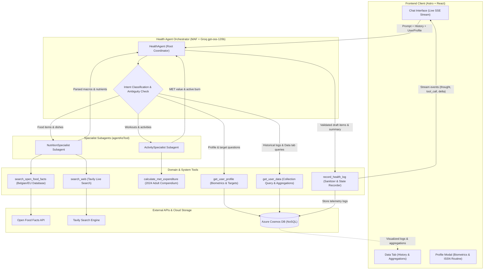

# how the agent works

## high-level architecture

## the guidance

The agent's decision-making and tool orchestration are governed by six core protocols:

1. **Nutritional Fact Grounding**:
   - Packaged grocery products (especially Belgian and European supermarket brands like Melkunie, Albert Heijn, Delhaize, Colruyt) are queried against `search_open_food_facts`.
   - Restaurant dishes, cooked meals, recipes, or unlisted foods fall back to live internet retrieval via `search_web` (Tavily).
   - All 7 core nutrients are calculated and scaled to portion: calories, protein (g), carbs (g), fat (g), fiber (g), sugar (g), and sodium (mg).

2. **Biomechanical Energy Expenditure**:
   - Exercises apply the **2024 Adult Compendium of Physical Activities** MET formulas using user body weight:
     - $\text{Total Burn} = \text{MET} \times \text{weight (kg)} \times \frac{\text{duration (min)}}{60}$
     - $\text{Net Active Burn} = (\text{MET} - 1) \times \text{weight (kg)} \times \frac{\text{duration (min)}}{60}$ (resting metabolic rate is excluded to prevent double-counting against BMR).

3. **Ambiguity & Context-Aware Estimation Protocol**:
   - **Ambiguity Detection**: If an entry lacks necessary portion sizes or durations, the agent prompts for clarification and offers an `"estimate"` alternative.
   - **Context-Aware Scaling**: When the user requests an estimate, the agent **never defaults blindly to static generic portions**. It actively scans for descriptive context clues (_size adjectives like "big bowl" or "small slice"_, _packaging fractions like "half the bottle"_, or _modifiers like "shared with a friend"_) to scale the estimate logically and explains the reasoning transparently.

4. **Multi-Turn Context Reconciler**:
   - Maintains memory across conversation turns. If the user modifies, corrects, or appends items (_"actually make that 3 eggs"_, _"change to 45 mins"_), the agent regenerates the full, updated set of draft entries rather than appending duplicates.

5. **Profile & Historical Collection Retrieval**:
   - `get_user_profile`: Returns calibrated biometrics (weight, height, age, sex, goal) and derived targets (BMR, TDEE, ISSN protein multiplier: 1.3g to 2.2g/kg based on training routine, fat, carbs, fiber, sugar, sodium).
   - `get_user_data`: Provides filtered access to the user's logged telemetry (by `time_filter`, `type`, `meal_type`, or `search_query`) and computes net calories and macro sums directly mirroring the Data tab.
   - For pure retrieval questions, the agent sets `draft_entries: []` so no phantom items are logged.

6. **Execution Sequence**:
   - Consults subagents/tools to calculate figures $\rightarrow$ invokes `record_health_log` with draft entries and reply $\rightarrow$ streams a concise, encouraging scientific summary to the user.

## common covered use cases

### 1. logging food intake (european grocery & meal lookup)

- **User input**: _"I drank 250ml Melkunie strawberry protein drink and ate 1 banana"_
- **How the system handles it**:
  1. `HealthAgent` deconstructs the request and consults `NutritionSpecialist`.
  2. `NutritionSpecialist` calls `search_open_food_facts("Melkunie strawberry protein drink")` to fetch the exact manufacturer nutrition facts per 100ml from the Belgian/EU database and scales it to 250ml.
  3. Looks up banana nutrition facts and sums the combined intake.
  4. Calls `record_health_log` with `needs_clarification: false` and the calculated draft entries.
  5. The UI displays interactive draft cards for immediate user confirmation or adjustment.

### 2. ambiguous portion with context-aware "estimate"

- **User input**:
  - _Turn 1_: _"I had a big bowl of oatmeal for breakfast"_
  - _Agent_: _"How much oatmeal did you have? If you're not sure, reply with 'estimate' and I'll make a reasonable assumption based on your description."_
  - _Turn 2_: _"estimate"_
- **How the system handles it**:
  1. Turn 1 detects missing grams/volume $\rightarrow$ sets `needs_clarification: true` with an interactive clarification prompt.
  2. On Turn 2, the agent resolves the estimate. Rather than using a generic standard 40g dry serving, it extracts the context clue _"big bowl"_.
  3. Scales the portion up logically ($\sim 1.5\times$ to 60g dry oats, $\sim 225\text{ kcal}$).
  4. Transparently explains the deduction: _"Based on your description of a 'big bowl', I estimated ~60g rolled oats..."_.
  5. Records the draft entries into the system.

### 3. physical activity & biomechanical met expenditure

- **User input**: _"Went for a 45 min vigorous run"_
- **How the system handles it**:
  1. `HealthAgent` consults `ActivitySpecialist` with the user's profile weight (e.g. 75 kg).
  2. Subagent matches running to the **2024 Adult Compendium of Physical Activities** (base MET 9.8 with vigorous intensity multiplier $\rightarrow$ 12.3 MET).
  3. Calls `calculate_met_expenditure` for 45 minutes:
     - Total Burn: $12.3 \times 75\text{ kg} \times 0.75\text{ hr} = 692\text{ kcal}$.
     - Net Active Burn: $(12.3 - 1) \times 75\text{ kg} \times 0.75\text{ hr} = 636\text{ kcal}$.
  4. Sets food macros to 0, modality to `cardio`, and intensity to `vigorous`.
  5. Calls `record_health_log` to present the workout draft card.

### 4. historical collection & daily budget retrieval

- **User input**: _"How much protein do I have left to hit my goal today?"_
- **How the system handles it**:
  1. `HealthAgent` identifies an informational query about daily targets and historical collection data.
  2. Calls `get_user_profile()` to fetch the user's calibrated daily protein target (e.g. 135g for a 75kg user on a Strength routine).
  3. Calls `get_user_data(time_filter: "today")` to fetch today's logged food entries and calculate total protein consumed so far (e.g. 50g).
  4. Computes the remaining delta: $135\text{g} - 50\text{g} = 85\text{g}$ remaining.
  5. Calls `record_health_log` with `draft_entries: []` and `needs_clarification: false` (avoiding logging phantom items).
  6. Streams a helpful response showing consumed vs target protein with personalized recommendations.
