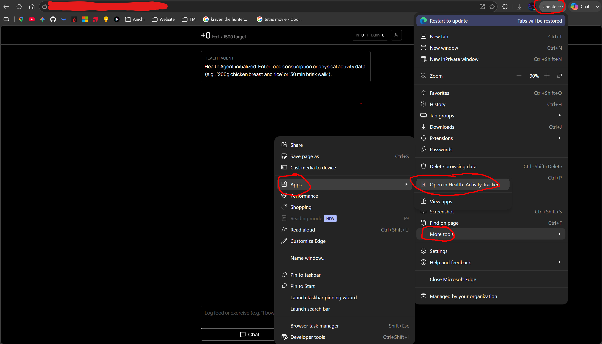

# install web app as app

this is how i access the app, because the url will be impossible to remember and type in every time (swa url is not very easy to remember).

## edge (desktop)

1. open the url in edge on your desktop

2. click on the 3 dots on the top right corner

3. now you can search up from your start menu for the app, pin it to taskbar if you want and be able to use it like an installed desktop app instead of on a browser tab.

## chrome (phone)

1. open the url in chrome on your phone

2. click on the 3 dots on the top right corner, and select "Install and create shortcut", and select the option "Install"

> [!NOTE]
> i already installed it show it shows up as "Open" instead of "Install", you will see "Install".

3. now you can access the app from your home screen like a normal app, and it will open in full screen without the browser stuff.
